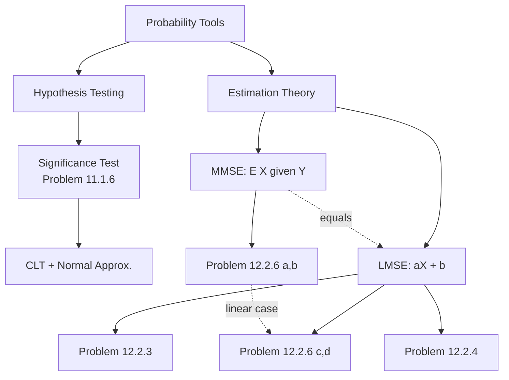

# EEE350 HW7 — Hypothesis Testing & MMSE Estimation

> [!abstract] Chat Summary
> This note walks through every problem in HW7 with full derivations, the overarching concept behind each problem, and links to related ideas. It is structured so each problem is a self-contained learning unit you can link out to from your vault.

## Table of Contents
- [[#Problem 11.1.6 — Significance Test for a Fair Coin]]
- [[#Problem 12.2.3 — Linear MMSE from a Discrete Joint PMF]]
- [[#Problem 12.2.4 — Linear MMSE for Continuous Joint PDF]]
- [[#Problem 12.2.6 — MMSE vs LMSE with an Erlang Prior]]
- [[#Master Concept Map]]
- [[#Formula Cheat Sheet]]

---

## Problem 11.1.6 — Significance Test for a Fair Coin

### Problem Statement
Let $K$ be the number of heads in $n = 100$ flips of a coin. Devise a significance test for the hypothesis $H$ that the coin is fair, with significance level $\alpha = 0.05$ and rejection set of the form $R = \{|K - \mathbb{E}[K]| > c\}$.

### Overarching Concept: Significance Testing
A **significance test** is a decision rule for rejecting a *null hypothesis* $H$ based on an observed statistic. The key ingredients are:

1. **Null hypothesis $H$** — the "default" belief we are trying to disprove (here: the coin is fair, so $p = 1/2$).
2. **Test statistic** — a random variable computed from the data (here: $K$, the number of heads).
3. **Rejection region $R$** — the set of statistic values that cause us to reject $H$.
4. **Significance level $\alpha$** — the maximum allowed probability of a *Type I error* (rejecting $H$ when it is actually true). Formally:
$$\alpha = P[\text{reject } H \mid H \text{ true}] = P[K \in R \mid H].$$

The art is: **pick the smallest $c$ such that $P[K \in R \mid H] \leq \alpha$.** Smaller $c$ = stronger test (more power), but we must respect the $\alpha$ budget.

> [!tip] Intuition
> Under $H$, you expect $K$ to hover around $\mathbb{E}[K]$. If the observed $K$ is *far* from that mean, $H$ looks unlikely. The rejection set $\{|K - \mathbb{E}[K]| > c\}$ formalizes "far."

### Solution

**Step 1 — Distribution under $H$.**
If the coin is fair, $K \sim \text{Binomial}(100, 0.5)$:
$$\mathbb{E}[K] = np = 50, \qquad \text{Var}(K) = np(1-p) = 25, \qquad \sigma_K = 5.$$

**Step 2 — Write down the condition on $\alpha$.**
We want:
$$P[\,|K - 50| > c \mid H\,] \leq 0.05.$$

**Step 3 — Use the Central Limit Theorem (normal approximation).**
Since $n = 100$ is large and $p = 0.5$, the CLT gives
$$\frac{K - 50}{5} \approx Z \sim \mathcal{N}(0,1).$$
So
$$P[\,|K - 50| > c\,] \approx P\!\left[|Z| > \tfrac{c}{5}\right] = 2\left(1 - \Phi\!\left(\tfrac{c}{5}\right)\right).$$

**Step 4 — Set this equal to $\alpha = 0.05$.**
$$2\left(1 - \Phi\!\left(\tfrac{c}{5}\right)\right) = 0.05 \;\;\Longrightarrow\;\; \Phi\!\left(\tfrac{c}{5}\right) = 0.975.$$
From the standard normal table, $\Phi^{-1}(0.975) = 1.96$, so
$$\tfrac{c}{5} = 1.96 \;\;\Longrightarrow\;\; \boxed{c = 9.8}.$$

**Step 5 — State the test.**
> Reject $H$ (decide the coin is *not* fair) if $|K - 50| > 9.8$, i.e., if $K \leq 40$ or $K \geq 60$.

### Key Takeaways
- The $1.96$ number is the **z-score for two-tailed $\alpha = 0.05$** — memorize it.
- For discrete $K$, you can round $c$ up to the nearest integer boundary ($c = 10$) to be conservative; this gives $P[\text{reject}] \leq \alpha$.
- Related: [[Central Limit Theorem]], [[Type I vs Type II Error]], [[Binomial Distribution]].

---

## Problem 12.2.3 — Linear MMSE from a Discrete Joint PMF

### Problem Statement
Random variables $X$ and $Y$ have joint PMF:

| $P_{X,Y}(x,y)$ | $y=-1$ | $y=0$ | $y=1$ |
|:---:|:---:|:---:|:---:|
| $x=-1$ | $3/16$ | $1/16$ | $0$ |
| $x=0$  | $1/6$  | $1/6$  | $1/6$ |
| $x=1$  | $0$    | $1/8$  | $1/8$ |

Estimate $Y$ by $\hat Y_L(X) = aX + b$.
- **(a)** Find $a, b$ minimizing mean-square error.
- **(b)** Find the minimum MSE $e_L^*$.

### Overarching Concept: Linear MMSE (LMSE) Estimation
When we restrict the estimator to be a **linear function** of the observation, the problem reduces to picking two scalars $(a, b)$. The optimal answer depends **only on first and second moments** — means, variances, and covariance — *not* on the full joint distribution.

The **LMSE formulas** (memorize these):
$$a^* = \frac{\text{Cov}(X,Y)}{\text{Var}(X)}, \qquad b^* = \mathbb{E}[Y] - a^*\,\mathbb{E}[X].$$
$$\hat Y_L(X) = \mathbb{E}[Y] + \frac{\text{Cov}(X,Y)}{\text{Var}(X)}\bigl(X - \mathbb{E}[X]\bigr).$$
$$e_L^* = \text{Var}(Y)\bigl(1 - \rho_{X,Y}^2\bigr) = \text{Var}(Y) - \frac{\text{Cov}(X,Y)^2}{\text{Var}(X)}.$$

> [!note] Why this works — the geometric picture
> Think of random variables as vectors in a Hilbert space with inner product $\langle U, V\rangle = \mathbb{E}[UV]$. The LMSE estimate is the **orthogonal projection** of $Y$ onto the 2-D subspace spanned by $\{1, X\}$. The residual $Y - \hat Y_L$ is orthogonal to both $1$ (zero mean) and $X$ (uncorrelated), which are exactly the two conditions that yield the formulas above.

### Solution

**Step 1 — Compute the marginals.**

*Marginal of $X$* (sum each row):
$$P_X(-1) = \tfrac{3}{16} + \tfrac{1}{16} + 0 = \tfrac{1}{4},\quad P_X(0) = \tfrac{1}{2},\quad P_X(1) = \tfrac{1}{4}.$$

*Marginal of $Y$* (sum each column; convert to common denominator $48$):
$$P_Y(-1) = \tfrac{3}{16} + \tfrac{1}{6} + 0 = \tfrac{9}{48} + \tfrac{8}{48} = \tfrac{17}{48},$$
$$P_Y(0) = \tfrac{1}{16} + \tfrac{1}{6} + \tfrac{1}{8} = \tfrac{3+8+6}{48} = \tfrac{17}{48},$$
$$P_Y(1) = 0 + \tfrac{1}{6} + \tfrac{1}{8} = \tfrac{8+6}{48} = \tfrac{14}{48}.$$

**Step 2 — First and second moments.**
$$\mathbb{E}[X] = -\tfrac{1}{4} + 0 + \tfrac{1}{4} = 0, \qquad \mathbb{E}[X^2] = \tfrac{1}{4} + 0 + \tfrac{1}{4} = \tfrac{1}{2}.$$
$$\text{Var}(X) = \tfrac{1}{2} - 0 = \tfrac{1}{2}.$$

$$\mathbb{E}[Y] = -\tfrac{17}{48} + 0 + \tfrac{14}{48} = -\tfrac{3}{48} = -\tfrac{1}{16}.$$
$$\mathbb{E}[Y^2] = \tfrac{17}{48} + 0 + \tfrac{14}{48} = \tfrac{31}{48}.$$
$$\text{Var}(Y) = \tfrac{31}{48} - \tfrac{1}{256} = \tfrac{496 - 3}{768} = \tfrac{493}{768}.$$

**Step 3 — Compute $\mathbb{E}[XY]$.**
Only cells with both $x \ne 0$ and $y \ne 0$ contribute:
$$\mathbb{E}[XY] = (-1)(-1)\tfrac{3}{16} + (1)(1)\tfrac{1}{8} = \tfrac{3}{16} + \tfrac{2}{16} = \tfrac{5}{16}.$$

$$\text{Cov}(X,Y) = \mathbb{E}[XY] - \mathbb{E}[X]\mathbb{E}[Y] = \tfrac{5}{16} - 0 = \tfrac{5}{16}.$$

**Step 4 — Apply LMSE formulas (part a).**
$$a^* = \frac{\text{Cov}(X,Y)}{\text{Var}(X)} = \frac{5/16}{1/2} = \boxed{\tfrac{5}{8}}.$$
$$b^* = \mathbb{E}[Y] - a^*\mathbb{E}[X] = -\tfrac{1}{16} - 0 = \boxed{-\tfrac{1}{16}}.$$

So $\hat Y_L(X) = \dfrac{5}{8}X - \dfrac{1}{16}$.

**Step 5 — Minimum MSE (part b).**
$$e_L^* = \text{Var}(Y) - \frac{\text{Cov}(X,Y)^2}{\text{Var}(X)} = \tfrac{493}{768} - \frac{(5/16)^2}{1/2} = \tfrac{493}{768} - \tfrac{25/256}{1/2}.$$
$$= \tfrac{493}{768} - \tfrac{50}{256} = \tfrac{493}{768} - \tfrac{150}{768} = \boxed{\tfrac{343}{768} \approx 0.447}.$$

### Key Takeaways
- LMSE needs only **5 numbers**: $\mathbb{E}[X], \mathbb{E}[Y], \text{Var}(X), \text{Var}(Y), \text{Cov}(X,Y)$.
- $e_L^*$ is always $\leq \text{Var}(Y)$; equality means $X$ gives us no linear info about $Y$.
- The ratio $\rho^2 = \dfrac{\text{Cov}(X,Y)^2}{\text{Var}(X)\text{Var}(Y)}$ is the **fraction of $Y$'s variance explained by $X$ linearly**.

---

## Problem 12.2.4 — Linear MMSE for Continuous Joint PDF

### Problem Statement
Random variables $X$ and $Y$ have joint PDF
$$f_{X,Y}(x,y) = \begin{cases} 2(y+x) & 0 \leq x \leq y \leq 1, \\ 0 & \text{otherwise.} \end{cases}$$
Find $\hat X_L(Y)$, the linear MMSE estimate of $X$ given $Y$.

### Overarching Concept: LMSE in Continuous Settings
The formulas are identical to the discrete case — we just replace sums with integrals. The only subtlety: **be careful with the support** $0 \leq x \leq y \leq 1$. This is a triangular region, so inner integral limits depend on the outer variable.

**LMSE of $X$ given $Y$** (flip the roles from before):
$$\hat X_L(Y) = \mathbb{E}[X] + \frac{\text{Cov}(X,Y)}{\text{Var}(Y)}\bigl(Y - \mathbb{E}[Y]\bigr).$$

### Solution

**Step 1 — Marginal of $Y$.**
For a fixed $y \in [0,1]$, $x$ ranges over $[0, y]$:
$$f_Y(y) = \int_0^y 2(y+x)\,dx = \bigl[2yx + x^2\bigr]_0^y = 2y^2 + y^2 = 3y^2, \quad 0 \leq y \leq 1.$$

**Step 2 — Moments of $Y$.**
$$\mathbb{E}[Y] = \int_0^1 y\cdot 3y^2\,dy = \tfrac{3}{4}, \qquad \mathbb{E}[Y^2] = \int_0^1 y^2\cdot 3y^2\,dy = \tfrac{3}{5}.$$
$$\text{Var}(Y) = \tfrac{3}{5} - \tfrac{9}{16} = \tfrac{48 - 45}{80} = \tfrac{3}{80}.$$

**Step 3 — Marginal of $X$.**
For fixed $x \in [0,1]$, $y$ ranges over $[x, 1]$:
$$f_X(x) = \int_x^1 2(y+x)\,dy = \bigl[y^2 + 2xy\bigr]_x^1 = (1 + 2x) - (x^2 + 2x^2) = 1 + 2x - 3x^2.$$

**Step 4 — Mean of $X$.**
$$\mathbb{E}[X] = \int_0^1 x(1 + 2x - 3x^2)\,dx = \tfrac{1}{2} + \tfrac{2}{3} - \tfrac{3}{4} = \tfrac{6 + 8 - 9}{12} = \tfrac{5}{12}.$$

**Step 5 — Compute $\mathbb{E}[XY]$.**
$$\mathbb{E}[XY] = \int_0^1\!\!\int_0^y xy\cdot 2(y+x)\,dx\,dy = \int_0^1\!\!\int_0^y (2xy^2 + 2x^2y)\,dx\,dy.$$
Inner integral:
$$\int_0^y (2xy^2 + 2x^2y)\,dx = \bigl[x^2y^2 + \tfrac{2}{3}x^3y\bigr]_0^y = y^4 + \tfrac{2}{3}y^4 = \tfrac{5}{3}y^4.$$
Outer:
$$\mathbb{E}[XY] = \int_0^1 \tfrac{5}{3}y^4\,dy = \tfrac{5}{15} = \tfrac{1}{3}.$$

**Step 6 — Covariance.**
$$\text{Cov}(X,Y) = \tfrac{1}{3} - \tfrac{5}{12}\cdot\tfrac{3}{4} = \tfrac{1}{3} - \tfrac{15}{48} = \tfrac{16}{48} - \tfrac{15}{48} = \tfrac{1}{48}.$$

**Step 7 — Assemble the LMSE estimate.**
$$a^* = \frac{\text{Cov}(X,Y)}{\text{Var}(Y)} = \frac{1/48}{3/80} = \frac{80}{144} = \tfrac{5}{9}.$$
$$b^* = \mathbb{E}[X] - a^*\mathbb{E}[Y] = \tfrac{5}{12} - \tfrac{5}{9}\cdot\tfrac{3}{4} = \tfrac{5}{12} - \tfrac{5}{12} = 0.$$

$$\boxed{\hat X_L(Y) = \tfrac{5}{9}\,Y.}$$

### Key Takeaways
- When $b^* = 0$, the regression line passes through the origin — usually a sign that $X$ and $Y$ both have means tied together by the geometry of the joint support.
- **Always sketch the support region** for continuous joint PDFs before setting up integrals. Getting the limits wrong is the #1 source of errors.
- Related: [[Marginal vs Conditional Density]], [[Double Integrals over Triangular Regions]].

---

## Problem 12.2.6 — MMSE vs LMSE with an Erlang Prior

### Problem Statement
$X$ has a second-order Erlang PDF
$$f_X(x) = \begin{cases} \lambda^2 x e^{-\lambda x} & x \geq 0, \\ 0 & \text{otherwise.} \end{cases}$$
Given $X = x$, $Y$ is uniform on $(0, x)$. Find:
- **(a)** MMSE of $Y$ given $X = x$: $\hat y_M(x)$.
- **(b)** MMSE of $X$ given $Y = y$: $\hat x_M(y)$.
- **(c)** LMSE of $Y$ given $X$: $\hat Y_L(X)$.
- **(d)** LMSE of $X$ given $Y$: $\hat X_L(Y)$.

### Overarching Concept: MMSE vs LMSE
This is the most important distinction in estimation theory. You should leave this problem understanding the following table cold:

| | **MMSE (unrestricted)** | **LMSE (linear only)** |
|:---|:---|:---|
| Estimator form | Any function $g(\cdot)$ | $aX + b$ only |
| Optimal answer | $\hat X_M(Y) = \mathbb{E}[X \mid Y]$ | $\hat X_L(Y) = \mu_X + \tfrac{\text{Cov}(X,Y)}{\text{Var}(Y)}(Y - \mu_Y)$ |
| Requires | Full conditional distribution | Only first/second moments |
| Error | Smallest possible MSE | $\geq$ MMSE error (equality iff $\mathbb{E}[X\mid Y]$ is linear in $Y$) |
| When they coincide | When $(X,Y)$ are **jointly Gaussian**, or when $\mathbb{E}[X\mid Y]$ happens to be linear | — |

> [!important] The Big Idea
> **MMSE** uses all the information in the joint distribution. **LMSE** uses only the covariance structure. The gap between them measures how much "nonlinear structure" the joint distribution has.

### Erlang-2 Facts (needed below)
For $X \sim \text{Erlang}(2, \lambda)$:
$$\mathbb{E}[X] = \tfrac{2}{\lambda}, \qquad \text{Var}(X) = \tfrac{2}{\lambda^2}, \qquad \mathbb{E}[X^2] = \tfrac{6}{\lambda^2}.$$

### Solution

---

#### (a) MMSE of $Y$ given $X = x$

Since $Y \mid X = x \sim \text{Uniform}(0, x)$:
$$\boxed{\hat y_M(x) = \mathbb{E}[Y \mid X = x] = \tfrac{x}{2}.}$$

That's it — the conditional distribution is given directly, so no integration is needed.

---

#### (b) MMSE of $X$ given $Y = y$

Here we need Bayes' rule to invert the conditioning.

**Step 1 — Joint PDF.**
$$f_{X,Y}(x,y) = f_{Y\mid X}(y\mid x)\,f_X(x) = \tfrac{1}{x}\cdot \lambda^2 x e^{-\lambda x} = \lambda^2 e^{-\lambda x}, \quad 0 \leq y \leq x.$$

**Step 2 — Marginal of $Y$.**
$$f_Y(y) = \int_y^\infty \lambda^2 e^{-\lambda x}\,dx = \lambda e^{-\lambda y}, \quad y \geq 0.$$
*So $Y$ is itself $\text{Exp}(\lambda)$ — neat!*

**Step 3 — Conditional of $X$ given $Y$.**
$$f_{X\mid Y}(x\mid y) = \frac{\lambda^2 e^{-\lambda x}}{\lambda e^{-\lambda y}} = \lambda e^{-\lambda(x - y)}, \quad x \geq y.$$
This says: given $Y = y$, the "extra" $X - y$ is $\text{Exp}(\lambda)$. 

**Step 4 — Conditional mean.**
With $U = X - y \sim \text{Exp}(\lambda)$, $\mathbb{E}[U] = 1/\lambda$, so
$$\boxed{\hat x_M(y) = \mathbb{E}[X \mid Y = y] = y + \tfrac{1}{\lambda}.}$$

> [!tip] Insight
> The MMSE estimate is **linear in $y$** here — so we expect LMSE in (d) to match it exactly.

---

#### (c) LMSE of $Y$ given $X$

**Means and variance of $X$:** already listed above.

**Mean of $Y$:**
$$\mathbb{E}[Y] = \mathbb{E}\!\bigl[\mathbb{E}[Y\mid X]\bigr] = \mathbb{E}\!\left[\tfrac{X}{2}\right] = \tfrac{1}{\lambda}.$$

**$\mathbb{E}[XY]$:**
$$\mathbb{E}[XY] = \mathbb{E}\!\bigl[X\cdot\mathbb{E}[Y\mid X]\bigr] = \mathbb{E}\!\left[\tfrac{X^2}{2}\right] = \tfrac{1}{2}\cdot\tfrac{6}{\lambda^2} = \tfrac{3}{\lambda^2}.$$

**Covariance:**
$$\text{Cov}(X,Y) = \tfrac{3}{\lambda^2} - \tfrac{2}{\lambda}\cdot\tfrac{1}{\lambda} = \tfrac{1}{\lambda^2}.$$

**LMSE coefficients:**
$$a^* = \frac{\text{Cov}(X,Y)}{\text{Var}(X)} = \frac{1/\lambda^2}{2/\lambda^2} = \tfrac{1}{2}, \qquad b^* = \tfrac{1}{\lambda} - \tfrac{1}{2}\cdot\tfrac{2}{\lambda} = 0.$$

$$\boxed{\hat Y_L(X) = \tfrac{X}{2}.}$$

*Notice this equals $\hat y_M(x)$ from part (a) — the MMSE was already linear, so LMSE matches it exactly.*

---

#### (d) LMSE of $X$ given $Y$

**Variance of $Y$:** Since $Y \sim \text{Exp}(\lambda)$:
$$\text{Var}(Y) = \tfrac{1}{\lambda^2}.$$
*(Alternatively: $\mathbb{E}[Y^2] = \mathbb{E}[X^2/3] = 2/\lambda^2$, so $\text{Var}(Y) = 2/\lambda^2 - 1/\lambda^2 = 1/\lambda^2$.)*

**LMSE coefficients:**
$$a^* = \frac{\text{Cov}(X,Y)}{\text{Var}(Y)} = \frac{1/\lambda^2}{1/\lambda^2} = 1, \qquad b^* = \tfrac{2}{\lambda} - 1\cdot\tfrac{1}{\lambda} = \tfrac{1}{\lambda}.$$

$$\boxed{\hat X_L(Y) = Y + \tfrac{1}{\lambda}.}$$

*This matches $\hat x_M(y)$ from part (b) exactly — as predicted, because $\mathbb{E}[X \mid Y]$ was linear in $Y$.*

### Key Takeaways
- **When MMSE is linear, MMSE = LMSE.** This problem is the textbook example of that principle.
- The trick for computing $\mathbb{E}[Y]$ and $\mathbb{E}[XY]$ is the **tower property / iterated expectation**: condition on $X$ first when the conditional $Y\mid X$ is easy.
- When you see Erlang($k, \lambda$) or Uniform$(0, X)$, try the tower property **before** attacking the joint directly.
- Related: [[Iterated Expectation]], [[Jointly Gaussian Random Variables]], [[Bayes Rule for Densities]].

---

## Master Concept Map

### How the HW Problems Connect
- **11.1.6** is the *decision-making* side of statistics: given data, do I reject a claim?
- **12.2.3, 12.2.4** are the *pure LMSE* problems — practice with discrete and continuous joints.
- **12.2.6** is the *unifying* problem — it forces you to compute both MMSE and LMSE and observe when they agree.

---

## Formula Cheat Sheet

### Significance Test (two-tailed, symmetric rejection)
- Under $H$: $T \sim \mathcal{N}(\mu_0, \sigma_0^2)$ (exact or via CLT).
- Reject if $|T - \mu_0| > z_{\alpha/2}\,\sigma_0$, where $z_{0.025} = 1.96$.

### LMSE Estimator
Given observation $X$, estimating $Y$:
$$\hat Y_L(X) = \mu_Y + \frac{\text{Cov}(X,Y)}{\text{Var}(X)}(X - \mu_X).$$
$$e_L^* = \text{Var}(Y)\bigl(1 - \rho^2\bigr), \quad \rho = \frac{\text{Cov}(X,Y)}{\sigma_X\,\sigma_Y}.$$

### MMSE Estimator
$$\hat Y_M(X) = \mathbb{E}[Y \mid X].$$
- Smallest possible MSE among all estimators (linear or nonlinear).
- Equals LMSE iff $\mathbb{E}[Y \mid X]$ is an affine function of $X$.

### Moment Shortcuts
- **Tower**: $\mathbb{E}[Y] = \mathbb{E}[\mathbb{E}[Y\mid X]]$ and $\mathbb{E}[XY] = \mathbb{E}[X\,\mathbb{E}[Y\mid X]]$.
- **Erlang $(k, \lambda)$**: $\mathbb{E}[X] = k/\lambda$, $\text{Var}(X) = k/\lambda^2$.
- **Uniform $(0, a)$**: $\mathbb{E} = a/2$, $\text{Var} = a^2/12$.
- **Binomial $(n, p)$**: $\mathbb{E} = np$, $\text{Var} = np(1-p)$.

---

## Gotchas & Questions Asked

This section tracks every question raised during the chat, framed as "gotchas" — subtle points that tripped me up or needed clarification. Each one is a landmine defused, ready to be referenced when similar confusion hits again.

---

### Gotcha #1 — "Are we finding how many trials reject our hypothesis given it's true?"

**Context:** Problem 11.1.6, trying to interpret what the significance test is actually computing.

**The Subtle Error:** Phrasing the problem as counting rejections across "trials" inside the 100 flips.

**The Correction:**
- The **100 flips are one single experiment** producing one value of $K$.
- The 5% significance level $\alpha$ refers to what would happen if we *hypothetically repeated the entire 100-flip experiment* many times under a truly fair coin.
- We'd wrongly reject fairness in about 5% of those repeated experiments — this is the frequentist guarantee of the test.

**Correct Mental Model:**
> We're budgeting for being wrong. We've decided we're willing to wrongly reject a fair coin 5% of the time. Given that budget, we choose the tightest rejection region possible — tighter = more likely to catch unfair coins (higher power).

**Clean One-Sentence Version:**
> "We're finding the cutoff $c$ such that, if the hypothesis were true, only 5% of possible outcomes would land in the rejection region."

**Key Distinction:**
| Wrong framing | Right framing |
|:---|:---|
| Counting rejections among 100 flips | Counting rejections among hypothetical repetitions of the whole 100-flip experiment |
| $\alpha$ = fraction of flips that reject | $\alpha$ = probability that one 100-flip experiment falsely rejects |

---

### Gotcha #2 — "What is the CLT function?"

**Context:** I used the CLT to turn the Binomial into a Normal in Problem 11.1.6 without explaining what CLT is.

**CLT = Central Limit Theorem.**

**Statement:**
> If $X_1, X_2, \ldots, X_n$ are i.i.d. with mean $\mu$ and finite variance $\sigma^2$, then as $n$ grows large,
> $$Z_n = \frac{\sum_{i=1}^n X_i - n\mu}{\sigma\sqrt{n}} \xrightarrow{d} \mathcal{N}(0, 1).$$

**Plain English:** Add up enough independent random things, and the sum looks Gaussian — regardless of what the individual things looked like.

**Why It's Almost Magical:** The shape of the original distribution (Bernoulli, uniform, exponential, etc.) gets washed out. The bell curve emerges from the averaging process itself.

**Applied to Problem 11.1.6:**
- Each flip $X_i \sim \text{Bernoulli}(0.5)$: $\mu = 0.5$, $\sigma^2 = 0.25$.
- Sum of heads: $K = \sum_{i=1}^{100} X_i$.
- CLT gives: $\dfrac{K - 50}{5} \approx \mathcal{N}(0, 1)$.
- This is exactly why we could use the z-score $1.96$ for $\alpha = 0.05$.

**Rules of Thumb — "When is $n$ big enough?":**
- **Symmetric distributions** (Bernoulli with $p = 0.5$): $n \approx 20$–$30$ is plenty.
- **Skewed distributions** (exponential): need $n \geq 50$ or more.
- **Binomial specifically:** need $np \geq 5$ **and** $n(1-p) \geq 5$. (Here $np = 50$, very safe.)

**The Deeper Why:** The sum's moment-generating function, when standardized, converges to $e^{t^2/2}$ — the Gaussian MGF. The cancellation of independent fluctuations produces the bell shape.

**CLT vs LLN — Don't confuse them:**
| **Law of Large Numbers (LLN)** | **Central Limit Theorem (CLT)** |
|:---|:---|
| The *average* $\bar X_n$ converges to $\mu$ | The *fluctuation* of $\bar X_n$ around $\mu$ is Gaussian with width $\sigma/\sqrt{n}$ |
| Tells you *where* the sum is headed | Tells you *how it's scattered* around that destination |
| "The mean stabilizes" | "The mean stabilizes *this way*" |

**Related Concepts:**
- [[Law of Large Numbers]]
- [[Normal Approximation to Binomial]]
- [[Standard Error]]
- [[Moment Generating Functions]]

---

### Gotcha #3 — "Why does this Gaussian distribution turn into a Normal distribution?"

**Context:** Seeing $\frac{K-50}{5} \approx Z \sim \mathcal{N}(0,1)$ in Problem 11.1.6.

**The Vocabulary Trap:**
> **"Gaussian" and "Normal" are the same distribution — just two names.**
> - *Gaussian* honors Carl Friedrich Gauss (astronomical error modeling, 1800s).
> - *Normal* comes later (Galton, Pearson), meant to imply "the typical/default shape."
> - The $\mathcal{N}$ in $\mathcal{N}(0,1)$ covers both names.

**The Real Question Underneath:** Why does $\frac{K-50}{5}$ turn a Binomial into a *standard* Normal?

**Answer: Two transformations are happening, not one.**

**Step 1 — CLT converts Binomial to Normal:**
$$K \sim \text{Binomial}(100, 0.5) \xrightarrow{\text{CLT}} K \approx \mathcal{N}(50, 25).$$
The CLT does the heavy lifting. $K$ itself is already approximately bell-shaped.

**Step 2 — Standardization converts Normal to *standard* Normal:**
$$K \approx \mathcal{N}(50, 25) \xrightarrow{\text{shift + rescale}} Z = \frac{K - 50}{5} \sim \mathcal{N}(0, 1).$$

**Why standardization works (algebra):** For any $K \sim \mathcal{N}(\mu, \sigma^2)$, define $Z = \frac{K - \mu}{\sigma}$:
- $\mathbb{E}[Z] = \frac{\mathbb{E}[K] - \mu}{\sigma} = 0$.
- $\text{Var}(Z) = \frac{1}{\sigma^2}\text{Var}(K) = 1$.
- **Linear transformations of a Normal stay Normal** — shape is preserved, only center and width change.

**Full Pipeline for Problem 11.1.6:**
$$\underbrace{K \sim \text{Bin}(100, 0.5)}_{\text{original}} \xrightarrow{\text{CLT}} \underbrace{K \approx \mathcal{N}(50, 25)}_{\text{Normal, non-standard}} \xrightarrow{\text{standardize}} \underbrace{Z = \tfrac{K-50}{5} \sim \mathcal{N}(0,1)}_{\text{standard Normal}}$$

**Why Standardize at All?**
Because tables and $z$-scores (like $1.96$) are defined **only for $\mathcal{N}(0,1)$**. Every other Normal is just a shifted, stretched copy. Standardization is the "unit conversion" that lets us use those tables.

**Visual Intuition — Same Shape, Different Axis:**
| Distribution | Center | Std Dev | Approx Range |
|:---|:---:|:---:|:---:|
| $K$ | 50 | 5 | 35 to 65 |
| $K - 50$ | 0 | 5 | −15 to +15 |
| $(K - 50)/5$ | 0 | 1 | −3 to +3 |

All three are the **same bell curve** — only the center and width change. Shape is invariant under shift and scale for Normals.

**Key Takeaway for My Vault:**
> Gaussian = Normal. The $\mathcal{N}(0,1)$ is just one specific Normal — the one with center 0 and width 1 — and every Normal can be converted to it by subtracting the mean and dividing by the standard deviation.

**Related Concepts:**
- [[Standardization / Z-score]]
- [[Linear Transformations of Normal Random Variables]]
- [[Standard Normal Table]]

---

### Gotcha #4 — "Does CLT turn every i.i.d. variable into a standard distribution with 0 mean and variance 1?"

**Context:** After seeing $\frac{K-50}{5} \approx \mathcal{N}(0,1)$, wondering if CLT itself always produces a standard Normal.

**Short Answer:** **No.** CLT and standardization are two separate operations that textbooks often combine, making them look like one.

**The Key Distinction:**
> **CLT is a shape theorem.** It says the distribution becomes Gaussian. The *center and width* of that Gaussian depend on what you're summing.
> **Standardization is a rescaling.** It subtracts the mean and divides by the std dev to get mean 0, variance 1.

**The Three Forms of CLT (all equivalent, different lenses):**

| Form | Expression | Approximate Distribution | Mean | Variance |
|:---|:---|:---|:---:|:---:|
| **Raw sum** | $S_n = \sum_{i=1}^n X_i$ | $\mathcal{N}(n\mu, n\sigma^2)$ | $n\mu$ | $n\sigma^2$ |
| **Sample mean** | $\bar X_n = \frac{1}{n}\sum X_i$ | $\mathcal{N}\!\left(\mu, \frac{\sigma^2}{n}\right)$ | $\mu$ | $\sigma^2 / n$ |
| **Standardized sum** | $Z_n = \frac{S_n - n\mu}{\sigma\sqrt{n}}$ | $\mathcal{N}(0, 1)$ | $0$ | $1$ |

All three are **the same theorem** viewed from three angles. Only Form 3 gives you standard Normal — and only because standardization was applied *after* CLT.

**Concrete Example — $X_i \sim \text{Uniform}(0, 10)$, $n = 100$ ($\mu = 5$, $\sigma^2 \approx 8.33$):**

| Quantity | Approx Distribution | Mean | Variance |
|:---|:---|:---:|:---:|
| $S_{100}$ | $\mathcal{N}(500, 833)$ | 500 | 833 |
| $\bar X_{100}$ | $\mathcal{N}(5, 0.083)$ | 5 | 0.083 |
| $\frac{S_{100} - 500}{\sqrt{833}}$ | $\mathcal{N}(0, 1)$ | 0 | 1 |

None of these is "more correct" than another — they're the same reality, different bookkeeping.

**Why Textbooks Usually Show Form 3:** It's the cleanest statement and directly plugs into $z$-tables. But this makes students think CLT *is* the standardization, which it isn't.

**Decision Rule for Problem Solving:**
1. **Raw sum or average?** — use Form 1 or 2, keep the original mean/variance.
2. **Need to use a $z$-table or critical value like $1.96$?** — standardize to Form 3.
3. **Want to compute a probability directly via integration?** — Form 1 works fine; no need to standardize.

**Applied to Problem 11.1.6:**
We could have written $P[K > 60] = P[K - 50 > 10]$ and integrated $\mathcal{N}(50, 25)$ directly. We standardized only because the $\alpha = 0.05 \Rightarrow z = 1.96$ lookup is cleaner on the standard Normal.

**Common Misconception Defused:**
> "CLT makes things $\mathcal{N}(0,1)$."
**Correct version:**
> "CLT makes things Gaussian — with whatever mean and variance the sum or average naturally has. Standardization is an extra step to convert that Gaussian into the standard one."

**Related Concepts:**
- [[Standardization / Z-score]] — the extra step
- [[Sample Mean vs Sample Sum]]
- [[Standard Error]] — the $\sigma/\sqrt{n}$ width of the sample mean's distribution

---

### Gotcha #5 — "How does the variance become 1 when there's a 5 on the bottom after standardization?"

**Context:** Computing $\text{Var}(Z)$ where $Z = \frac{K - 50}{5}$ and $\text{Var}(K) = 25$. Not seeing how the 5 "kills" the 25.

**The Missing Rule:**
> $$\text{Var}(cX) = c^2 \cdot \text{Var}(X).$$
> **Scaling a random variable by $c$ scales the variance by $c^2$ — not $c$.**

**Why the Squaring:** Variance is $\mathbb{E}[(X - \mu)^2]$. The squared term inside means constants come out squared:
$$\text{Var}(cX) = \mathbb{E}[(cX - c\mu)^2] = \mathbb{E}[c^2(X-\mu)^2] = c^2\,\text{Var}(X).$$

**Step-by-Step for $Z = \frac{K-50}{5}$:**

| Step | Operation | Result |
|:---:|:---|:---|
| 1 | Start: $\text{Var}(K)$ | $25$ |
| 2 | Subtract constant: $\text{Var}(K - 50) = \text{Var}(K)$ | $25$ (shifting doesn't change width) |
| 3 | Divide by 5: $\text{Var}\!\left(\frac{K - 50}{5}\right) = \left(\frac{1}{5}\right)^2 \text{Var}(K - 50)$ | $\frac{1}{25} \cdot 25 = 1\;\checkmark$ |

**The 5 becomes a 25 under the squaring, and that 25 exactly cancels the variance of $K$.**

**Easier Mental Model — Think in Standard Deviations:**
$$\text{SD}(cX) = |c| \cdot \text{SD}(X) \quad \text{(linear, no squaring)}.$$
- $\text{SD}(K) = 5$
- $\text{SD}\!\left(\frac{K}{5}\right) = \frac{5}{5} = 1$
- Variance = SD², so variance is also 1. ✓

**Why We Divide By $\sigma$ Specifically:**
Not arbitrary — **it's reverse-engineered to make variance equal 1.**
$$\text{Var}\!\left(\frac{K - \mu}{\sigma}\right) = \frac{1}{\sigma^2} \cdot \sigma^2 = 1.$$
The $\sigma^2$ in the denominator is designed to eat the $\sigma^2$ variance of $K$. Divide by anything else and you don't get standard Normal.

**Reference Table — How Moments Change Under Linear Ops:**

| Operation | Effect on Mean | Effect on Variance | Effect on Std Dev |
|:---|:---:|:---:|:---:|
| $X + c$ | $\mu \to \mu + c$ | unchanged | unchanged |
| $X - c$ | $\mu \to \mu - c$ | unchanged | unchanged |
| $cX$ | $\mu \to c\mu$ | $\sigma^2 \to c^2\sigma^2$ | $\sigma \to \|c\|\sigma$ |
| $X / c$ | $\mu \to \mu/c$ | $\sigma^2 \to \sigma^2/c^2$ | $\sigma \to \sigma/\|c\|$ |

**Full Standardization Recap:**
- Subtraction of $\mu$ → kills the mean (makes it 0).
- Division by $\sigma$ → kills the variance (makes it 1).
- Result: **any Normal becomes the standard Normal $\mathcal{N}(0,1)$.**

**Key Takeaway for My Vault:**
> Whenever you see a random variable divided by a constant, **square that constant** before applying it to the variance. The variance is on a different scale than the variable itself.

**Related Concepts:**
- [[Linearity of Expectation]] — mean is linear, no squaring
- [[Properties of Variance]] — variance is quadratic, hence squaring
- [[Standardization / Z-score]] — the canonical use case

---

## Q&A Log (Chronological)

| # | Question | Resolved in |
|:---:|:---|:---|
| Q1 | Walk through each problem and teach the overarching concepts | Main body of this note |
| Q2 | Are we trying to find how many trials reject our hypothesis given it's true? | [[#Gotcha #1 — "Are we finding how many trials reject our hypothesis given it's true?"]] |
| Q3 | What is the CLT function? | [[#Gotcha #2 — "What is the CLT function?"]] |
| Q4 | Why does this Gaussian distribution turn into a Normal distribution? | [[#Gotcha #3 — "Why does this Gaussian distribution turn into a Normal distribution?"]] |
| Q5 | Does CLT turn every i.i.d. variable into a standard distribution with 0 mean and variance 1? | [[#Gotcha #4 — "Does CLT turn every i.i.d. variable into a standard distribution with 0 mean and variance 1?"]] |
| Q6 | How does the variance become 1 when there's a 5 on the bottom after standardization? | [[#Gotcha #5 — "How does the variance become 1 when there's a 5 on the bottom after standardization?"]] |

---

*Last updated: 2026-04-23*
